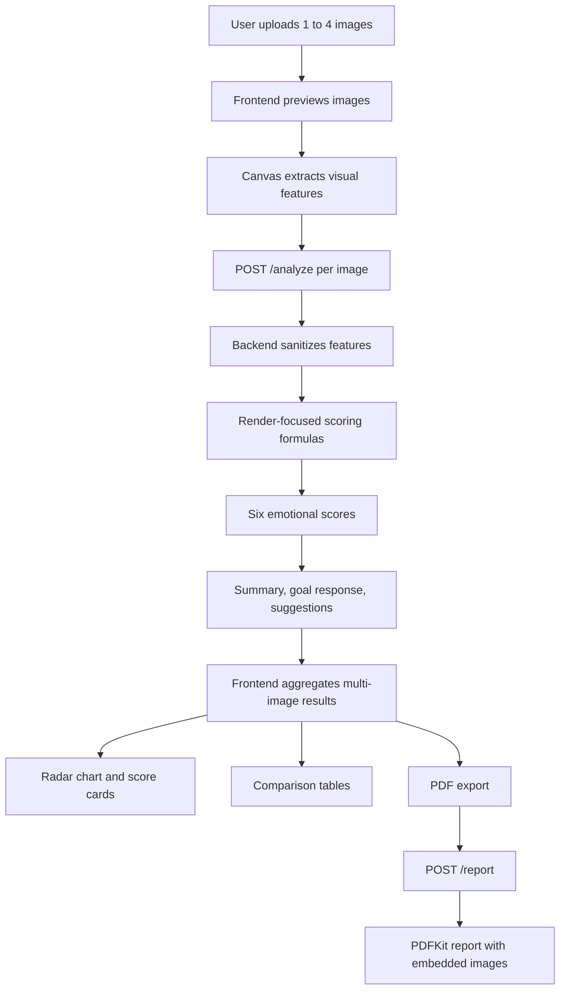
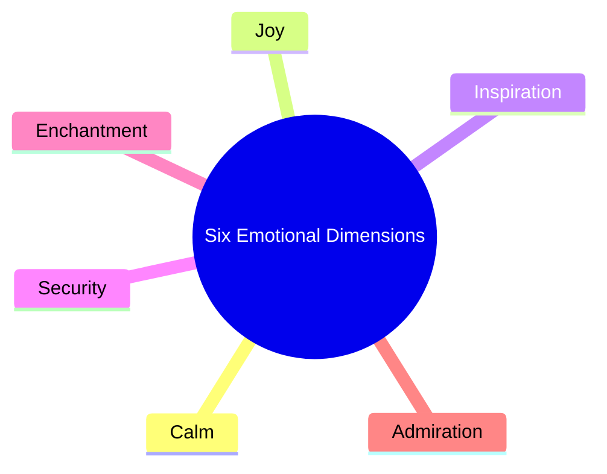
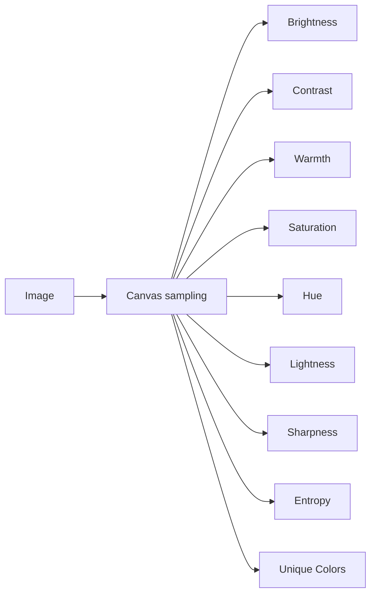
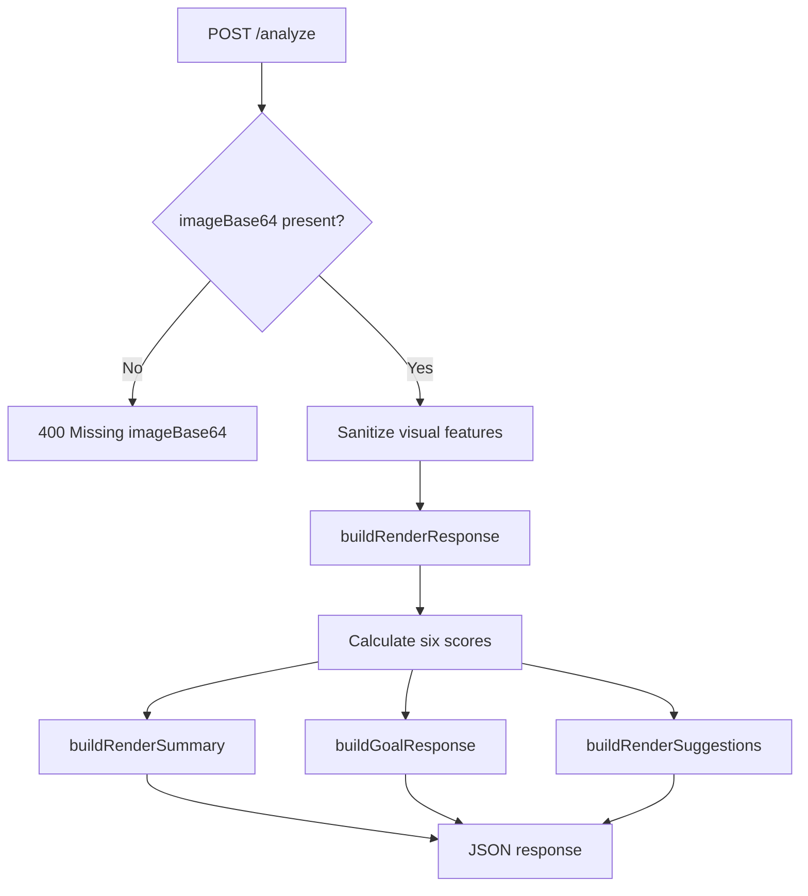
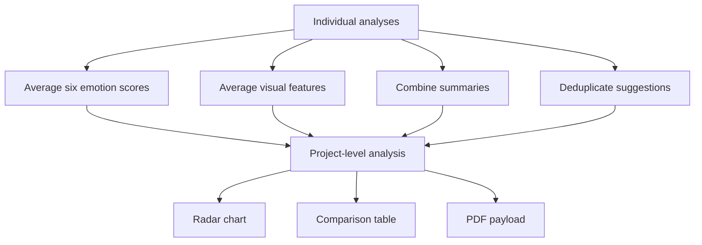
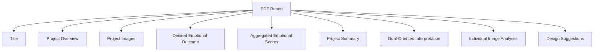
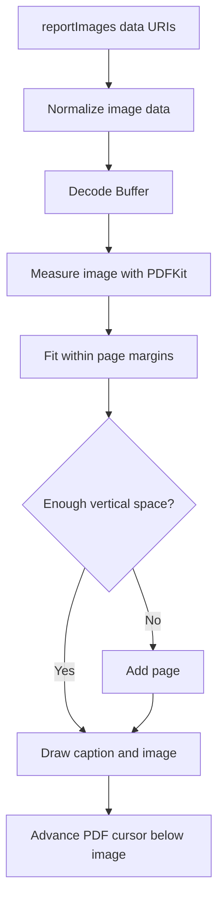
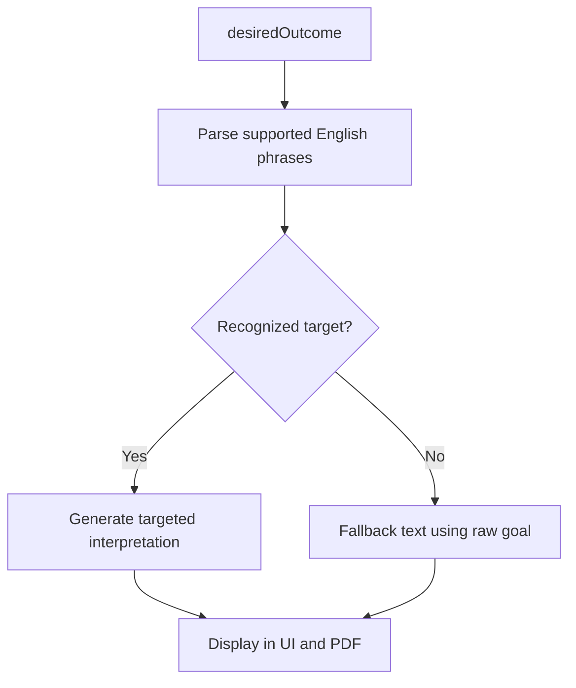
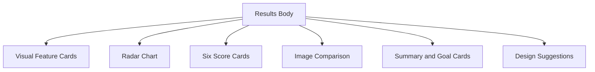

# Diagrams and Formulas

This document summarizes the active AI Architectural Critic workflow, the six-emotion model, and the render-focused scoring formulas.

## System Flow

## Active Emotion Set

## Visual Features

## Render-Focused Scoring Formulas

All feature values are normalized to 0-100. `NOT x` means `100 - x`.

| Emotion | Formula Summary | Interpretation |
| --- | --- | --- |
| Calm | brightness + NOT contrast + warmth + NOT saturation + lightness + NOT entropy + NOT sharpness + NOT unique colors | Quiet, legible, visually controlled |
| Joy | brightness + warmth + saturation + lightness + entropy + unique colors + yellow hue + NOT contrast | Bright, warm, open, positive |
| Inspiration | brightness + contrast + saturation + warmth + sharpness + entropy + unique colors | Bold, clear, stimulating |
| Security | brightness + warmth + NOT contrast + NOT saturation + lightness + NOT entropy + NOT sharpness + NOT unique colors | Stable, reassuring, legible |
| Enchantment | brightness + contrast + saturation + entropy + unique colors + sharpness + warmth | Atmospheric, layered, memorable |
| Admiration | brightness + contrast + saturation + sharpness + entropy + unique colors + warmth | Refined, distinctive, intentional |

## Backend Analysis Flow

## Multi-Image Aggregation

## PDF Report Structure

## PDF Image Placement

## Goal-Oriented Interpretation

Supported target phrases:

- more calm
- more joy
- more inspiration
- more security
- more enchantment
- more admiration
- less anxiety
- less stress

## Frontend Layout

The results layout uses CSS grid areas to keep sections stable across screen sizes and content lengths.
